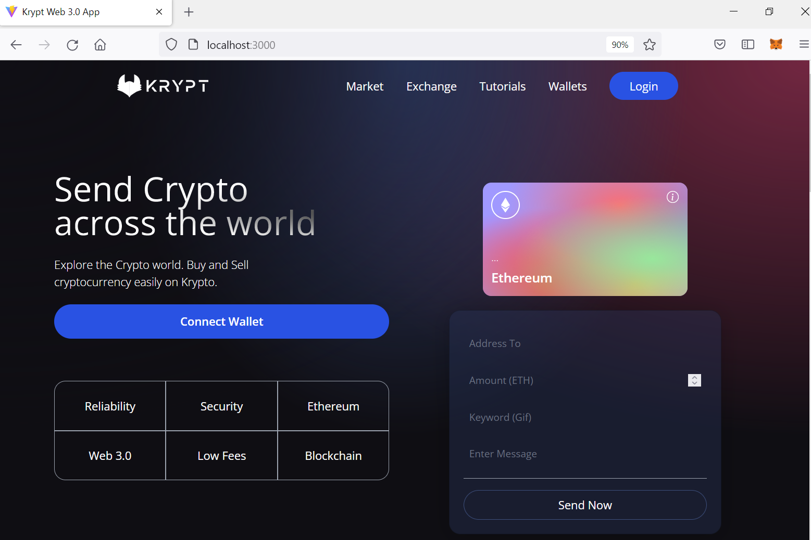
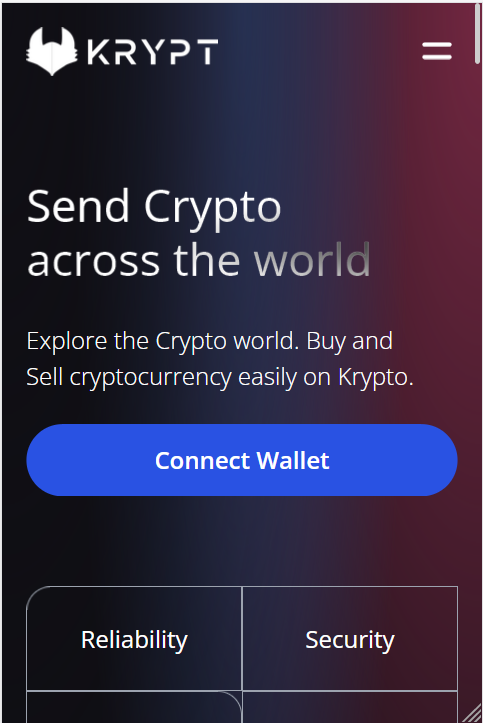
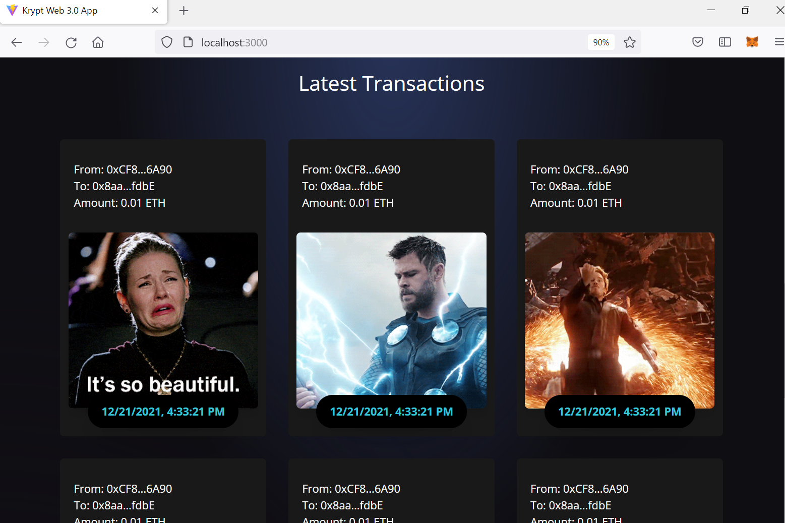
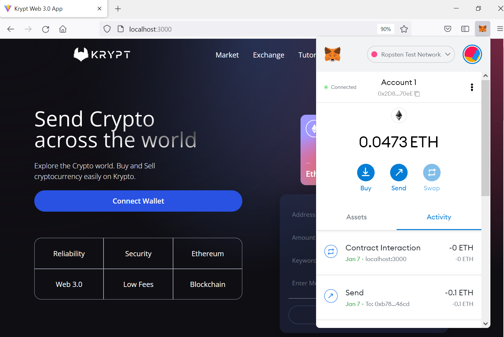
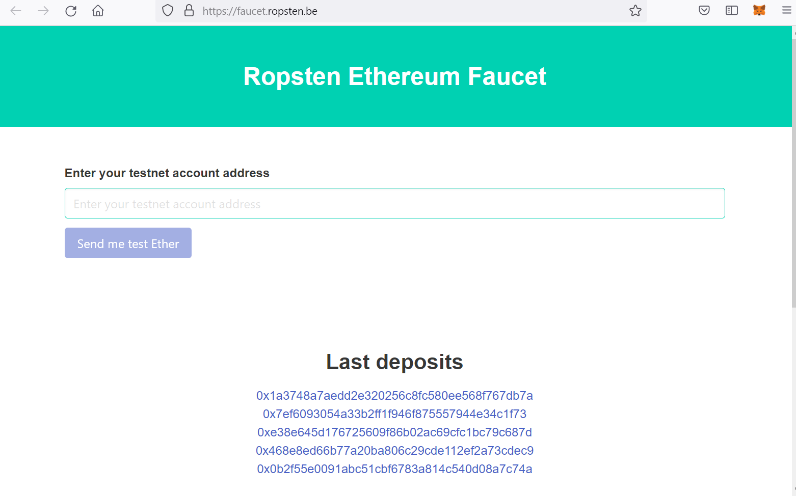

## Krypt Web 3.0 Demo

This Project is Krypt Web 3.0 Demo in which we can transfer amount from one ethereum account another account.

### Home Section 
 

### Home Section in mobile 
 

### Transaction section
 

### Metamask 
 
please install the metamask plugin into your browser, using following steps :-
 

https://www.geeksforgeeks.org/how-to-install-and-use-metamask-on-google-chrome/

### Ropsten Ethereum faucet
 
How to add ethereum money into account for testing purpose.

https://faucet.ropsten.be/

